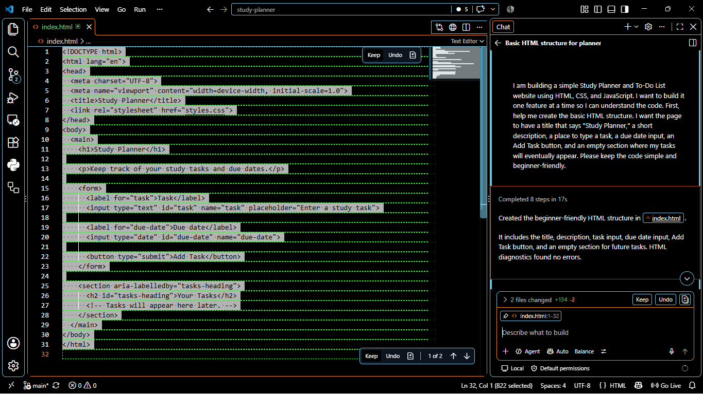
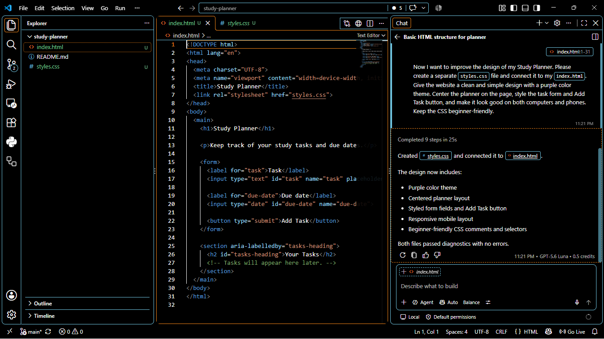
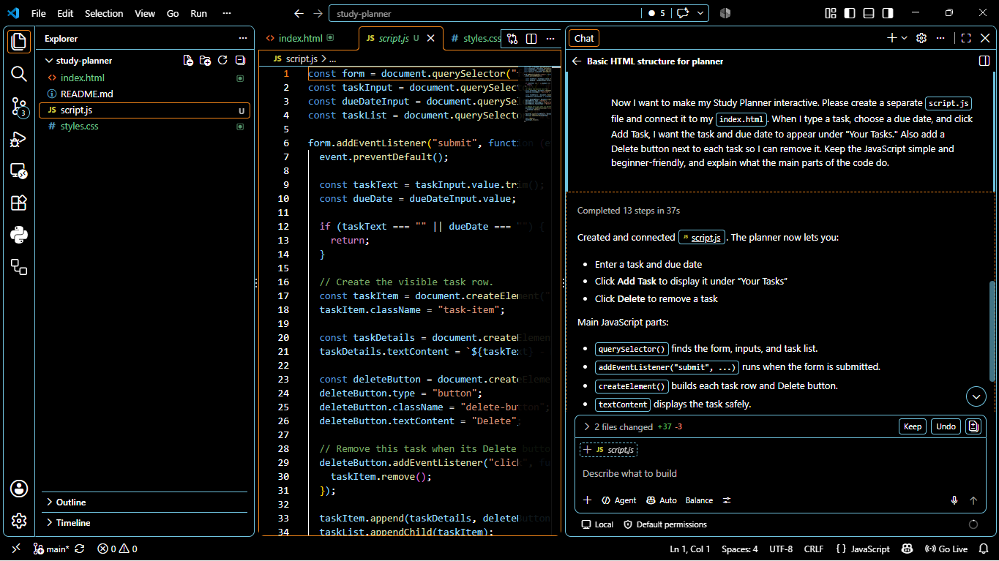
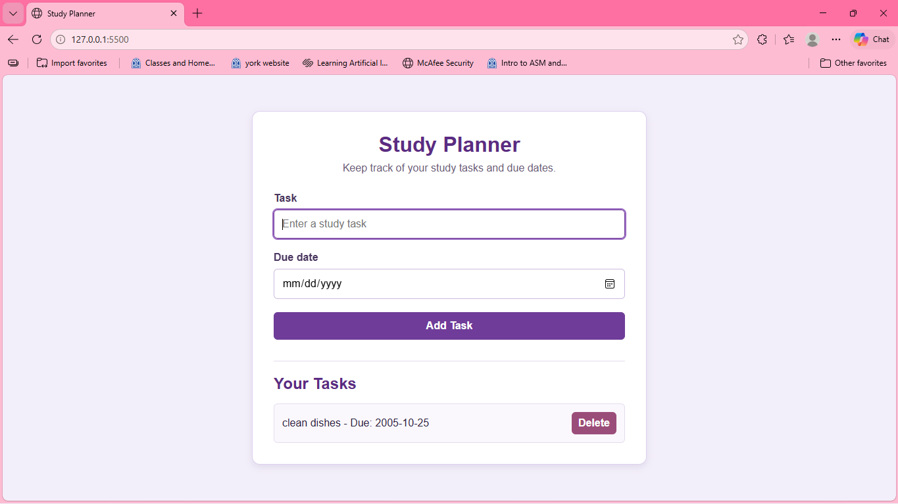
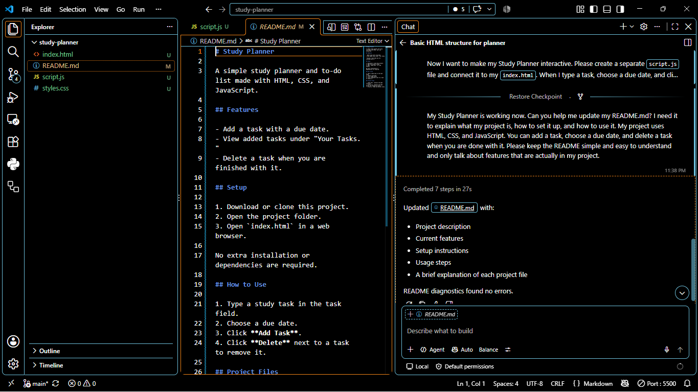

#What did you ask Copilot to help you build?

I asked Copilot to help me build a Study Planner website. I wanted the website to help me add tasks and keep track of when they are due.

#How did you break down the problem?

I broke the project into smaller steps instead of doing everything at once. First I made the basic website, then added the purple design, and last I made the buttons work.

#How did your approach to asking questions change as you worked?

At first, I asked Copilot simple questions because I wasn't sure what to ask. As I kept working, I started being more clear about what I wanted it to do.

#What parts of the development process with GitHub Copilot surprised you?

I was surprised by how fast Copilot could make code for me. I also liked that I could ask it to change something without having to start the whole project over.

#What did you learn about the technology you used that you didn't know before?

I learned more about how HTML, CSS, and JavaScript work together. HTML makes the website, CSS makes it look better, and JavaScript makes things like the Add and Delete buttons work.

#What would you do differently if you had to build this again?

If I had to build this again, I would plan out what I wanted before I started. I would also keep doing one thing at a time because that made the project easier for me to understand.

#Screenshots

#Starting the Website

#Adding the Design

#Adding JavaScript

#Finished Website

#Updating the README
